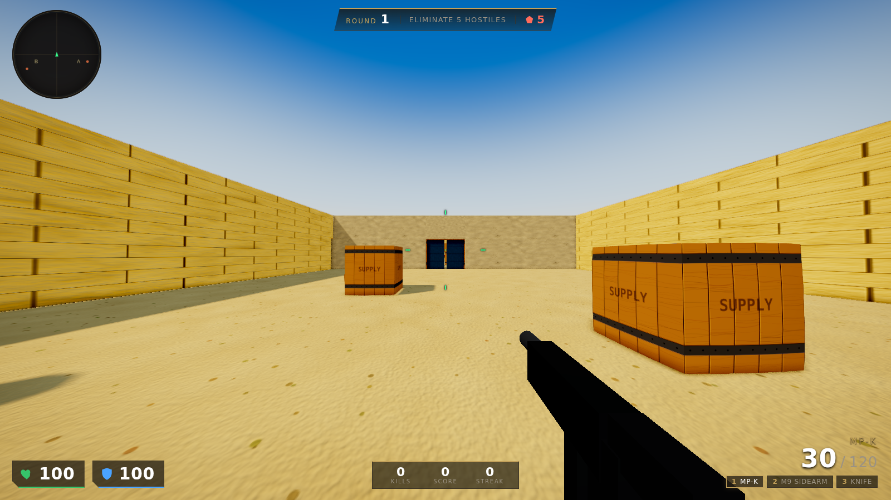
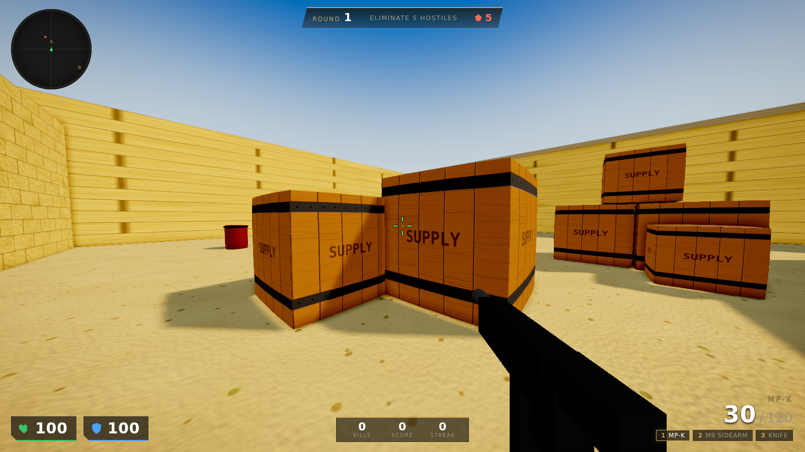
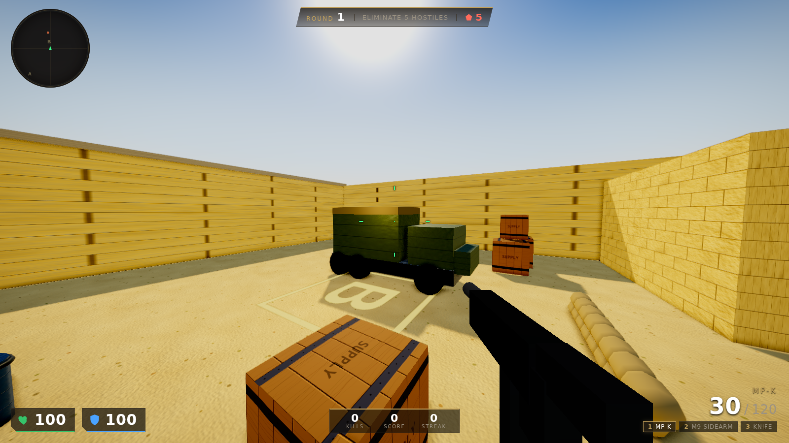

# OPERATION: DESERT STORM

A **CS:GO‑style first‑person shooter that runs in the browser** — real‑time
WebGL, custom physics, hunting bot AI, a round system, and a `de_dust2`‑inspired
desert map. Every texture is painted procedurally and every sound is synthesized
in code, so the whole game ships with **zero image/audio files and zero runtime
dependencies**.

> Built with [Three.js](https://threejs.org) (vendored, r160). No build step,
> no bundler, no network at runtime — clone it and it plays offline.



| Bombsite A | Bombsite B |
|---|---|
|  |  |

---

## Run it

You need a desktop browser with a mouse (Pointer Lock is required) and Node.js
to serve the files over HTTP (ES‑module + import‑map games can't run from
`file://`).

```bash
npm start            # serves on http://localhost:8080
# or pick a port:
PORT=3000 npm start
```

Open the URL, click **DEPLOY**, then click the screen to lock the mouse.

Any static file server works too (e.g. `python3 -m http.server`), as long as
`.js` is served as `text/javascript`.

## Controls

| Input | Action | Input | Action |
|---|---|---|---|
| `W A S D` | Move | `R` | Reload |
| Mouse | Aim / look | `Right‑click` | Aim / scope (sniper) |
| `Left‑click` | Fire | `Shift` | Walk (quiet) |
| `Space` | Jump | `Ctrl` / `C` | Crouch |
| `1 2 3` | Weapon slots | `Q` / wheel | Quick‑swap |
| `G` | Pick up a downed bot's weapon | `Esc` | Pause |

## The game

- **Movement** — Quake/CS‑style ground friction + capped acceleration, limited
  air control, crouch/sprint/jump, view‑bob, landing & recoil camera shake.
- **Weapons** — knife, pistol, SMG, two rifles (high‑damage hard‑kicking vs.
  controllable), a scoped bolt‑action sniper, and a spread shotgun. Each has its
  own damage, fire rate, magazine, reload, range falloff, headshot multiplier,
  procedural recoil "spray" and a hand‑built viewmodel with muzzle flash and
  shell ejection.
- **The map** — an original three‑lane bomb‑defusal arena evoking dust2: B
  tunnels, mid with the iconic double‑doors, A long, two bombsites (a hero cargo
  truck at **B**, a raised platform at **A**), crates, barrels, sandbags, palms
  and arches in warm sandstone.
- **Bots** — sculpted soldiers that perceive you through a field‑of‑view cone +
  line‑of‑sight **and by hearing your footsteps/gunfire**, hunt you with A\*
  pathfinding, take ground, strafe, reload behind cover and shoot back with
  difficulty‑scaled aim, reaction time and recoil. Headshots matter — for them
  and for you.
- **Rounds** — clear every hostile to win the round; each round spawns more bots
  with sharper aim and better guns. Health + armor, kill counter, score and kill
  streaks. Death ends the run.
- **Feedback** — dynamic crosshair (expands with inaccuracy), hit markers,
  directional damage arcs, low‑health vignette, kill feed, radar, blood, sparks,
  dust, bullet‑hole decals and tracers.
- **Audio** — 100% Web‑Audio synthesis: per‑weapon gunshots, reloads, footsteps,
  bullet whizz, explosions, UI and round stingers, ambient wind, and
  **spatialised enemy fire** (stereo pan + distance falloff).
- **Graphics** — procedural PBR materials with derived normal maps, image‑based
  lighting (sky‑prefiltered environment reflections), a shadow‑casting sun,
  GTAO ambient occlusion, bloom, a filmic warm color grade + vignette, FXAA and
  ACES tone mapping.

## Architecture

```
index.html            import‑map + HUD/menu DOM
styles/main.css        HUD & menu styling
vendor/                Three.js r160 + postprocessing addons (vendored)
src/
  main.js              bootstrap, pointer‑lock flow, render loop
  core/                Engine (render+post), Input, AssetForge (textures), Geo
  audio/AudioEngine    synthesized SFX
  world/               Collision (AABB+broadphase), MapBuilder, Nav (A*)
  entities/            Player, Weapon(+Data), Enemy(+AI), Combat (hitscan)
  fx/FX                pooled particles, decals, tracers, lights
  ui/                  HUD, Menus
  game/Game            rounds, spawns, win/lose orchestration
tools/                 headless tests + screenshot tool
```

## Tests

```bash
npm run check         # syntax-check every module + headless logic tests
npm run test:smoke    # boot the game in headless Chrome, run 10s of AI/combat
npm run test:combat   # deterministic duel: player↔bot damage both directions
npm run shots         # render high-quality showcase screenshots
```

The logic tests exercise collision resolution, A\* pathfinding, line‑of‑sight and
gravity headlessly; the browser tests boot the real game under software WebGL and
fail on any runtime error.

## Settings

Sensitivity, FOV, master volume, graphics quality (High/Medium/Low), bloom and
invert‑Y are adjustable in‑game and persisted to `localStorage`.

## License

MIT. All art and audio are generated at runtime; no third‑party game assets are
included. The map is an original layout *inspired by* the dust2 archetype, not a
copy of any copyrighted asset.
